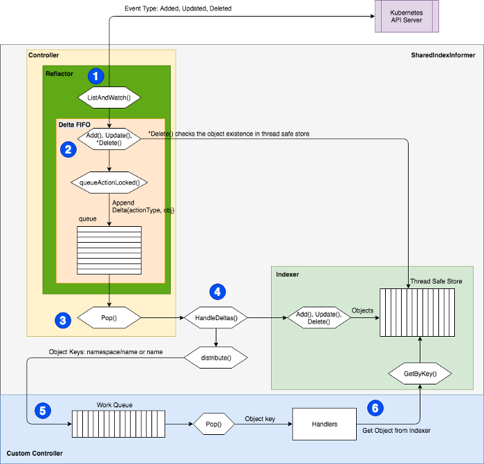

# Nlb-Attacher

The vpc CNI offers a unique ability for every pod to be directly addressable on the vpc fabric. This allows us to attach pods directly to target groups and therefore Network Load Balancers without needing an intermediate proxy. By removing the intermediate proxy we can decrease end to end latency and we can have persistent sockets that remain open for the entire life of a pod. 

## Architecture
---

At the core of the nlb-attacher is a [client-go/tools/cache.SharedIndexInformer](https://godoc.org/k8s.io/client-go/tools/cache#SharedIndexInformer) . This is a piece of software built into the client-go k8s library that maintains an eventually consistent state of any subset of kubernetes api primitives. The state is maintained by LIST and WATCH funcs - LIST is run on a periodic schedule to reconcile state and WATCH runs all the time passing off events to a handler.

A SharedIndexInformer is not designed for high backpressure, as such the delta reconciliation must be handled by a component better suited for async tasks. To accomplish this the nlb-attacher utilizes [client-go/util/workqueue](https://godoc.org/k8s.io/client-go/util/workqueue). The nlb-attacher utilizes a workqueue with a ratelimiter (default settings) that ensures no more than 10 queue items can be handled per second and that each unique item has an exponential failure controller to prevent crashlooping on a single bad key (5ms to 1000 seconds exponential ramp).

The NLB attacher internally implements a "controller" that listens to the work queue and forever loops waiting for an available event.

An architectural block diagram is as follows:

### Additional Reading

I found the following snippet to be pretty helpful in understanding all of the underlying pieces:

> Textually, a SharedIndexInformer “is a” `SharedInformer`, which manages a `Controller`, and, indirectly a `Reflector`, that uses a Kubernetes client and a `ListerWatcher` implementation to update a particular kind of Store, namely a `DeltaFIFO`, with logical events representing modifications, additions and deletions made to listed and watched Kubernetes resources.  
The Store it returns from its `getStore()` method, is actually an `Indexer`, implemented via the cache type in the Go code.  (Note in particular that its `getStore()` method returns the return value of its `getIndexer()` method, which means notably that the `Store` that the caller has access to is not the `DeltaFIFO` that it updates internally as an implementation concern.  Also remember that at any given point if you have a `Store` of any kind in your hands there may be only certain functions you are allowed to call.)

Source: https://lairdnelson.wordpress.com/2018/01/10/understanding-kubernetes-tools-cache-package-part-5/

